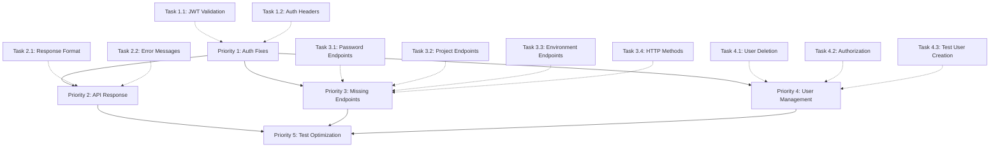

# Task Execution Order & Dependencies

## Critical Path Analysis



## Phase 1: Critical Fixes (0-3 hours)
**Must complete first - blocks everything else**

```
Parallel Execution:
├── Team A: Task 1.1 (JWT Token Validation Issues)
│   ├── Files: AuthService.php, AuthHandler.php
│   ├── Impact: Token lifecycle, refresh logic
│   └── Estimated: 1.5 hours
└── Team B: Task 1.2 (Authorization Header Validation)
    ├── Files: AuthMiddleware.php
    ├── Impact: Header parsing, error responses
    └── Estimated: 1 hour

Sequential (after above complete):
└── Task 1.3 (Authentication Flow Consistency)
    ├── Dependencies: 1.1, 1.2 complete
    ├── Files: AuthService.php, AuthHandler.php
    └── Estimated: 0.5 hours
```

## Phase 2: API Standardization (3-5 hours)
**Can start after Phase 1 complete**

```
Parallel Execution:
├── Team A: Task 2.1 (Missing 'data' Field)
│   ├── Files: All handlers, ResponseHelper.php
│   ├── Impact: Response format consistency
│   └── Estimated: 1 hour
├── Team B: Task 2.2 (Error Message Standardization)
│   ├── Files: All handlers
│   ├── Impact: Test expectation matching
│   └── Estimated: 1 hour
├── Team C: Task 3.1 (Password Management Endpoints)
│   ├── Files: AuthHandler.php, routes
│   ├── Impact: forgot/reset password functionality
│   └── Estimated: 1 hour
└── Team D: Task 3.2 (Project Management Endpoints)
    ├── Files: ProjectHandler.php
    ├── Impact: Project CRUD operations
    └── Estimated: 1 hour

Sequential (after above complete):
├── Task 2.3 (Response Validation Helper)
│   └── Dependencies: 2.1 complete
└── Task 3.3-3.5 (Environment, HTTP Methods, Testing)
    └── Dependencies: 3.1, 3.2 complete
```

## Phase 3: User Management (5-8 hours)
**Can start after Phase 1 complete**

```
Parallel Execution:
├── Team A: Task 4.1 (User Deletion Issues)
│   ├── Files: UserHandler.php, UserRepository.php
│   ├── Impact: Delete operations, test cleanup
│   └── Estimated: 1.5 hours
└── Team B: Task 4.2 (Authorization Without Authentication)
    ├── Files: AuthMiddleware.php
    ├── Impact: 401 vs 404 error codes
    └── Estimated: 1 hour

Sequential (after above complete):
├── Task 4.3 (User Creation for Tests)
│   └── Dependencies: 4.1, 4.2 complete
├── Task 4.4 (Pagination and Search)
│   └── Dependencies: 4.1, 4.2, 4.3 complete
└── Task 4.5 (User Status Management)
    └── Dependencies: 4.1, 4.2, 4.3 complete
```

## Phase 4: Optimization (8-10 hours)
**Can start after all above phases complete**

```
Parallel Execution:
├── Team A: Task 5.1 (Test Data Cleanup)
├── Team B: Task 5.2 (Performance Optimization)
└── Team C: Task 5.3 (Edge Case Handling)

Sequential (after above complete):
├── Task 5.4 (Test Suite Optimization)
└── Task 5.5 (Documentation and Comments)
```

## Resource Allocation

### Maximum Parallel Teams: 4
- **Team 1**: Authentication & Authorization specialist
- **Team 2**: API Response & Validation specialist
- **Team 3**: Endpoint Implementation specialist
- **Team 4**: User Management & Testing specialist

### Critical Bottlenecks:
1. **Priority 1** must complete before other phases
2. **Test user creation** depends on working auth system
3. **Response format** affects all other modules

### Risk Mitigation:
- **Priority 1**: Focus on JWT and middleware fixes first
- **Parallel Work**: Independent modules can be worked on simultaneously
- **Testing**: Validate each fix before moving to next phase

## Success Checkpoints

- **Checkpoint 1 (3 hours)**: All authentication tests passing
- **Checkpoint 2 (5 hours)**: API responses consistent, core endpoints working
- **Checkpoint 3 (8 hours)**: User management functionality complete
- **Checkpoint 4 (10 hours)**: All tests passing, performance optimized