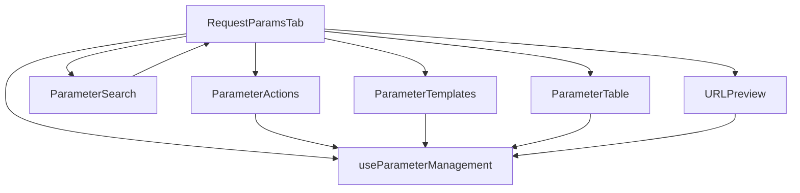

# Refactoring Strategy: RequestParamsTab.tsx

## 📊 Current Analysis

**File**: `src/components/workspace/request-tabs/RequestParamsTab.tsx`
**Lines**: 470 lines (🚨 **OVER LIMIT**)
**Problem**: Multiple responsibilities, terlalu kompleks, sulit di-maintain

## 🎯 Refactoring Goal
Memecah component besar menjadi **multiple smaller components** (< 300 lines) dengan **single responsibility principle**.

## 🏗️ Component Breakdown Strategy

### 1. **Parameter Management Hooks** 🎣
**File**: `src/hooks/useParameterManagement.ts`
**Lines**: ~120 lines
**Responsibility**: Business logic untuk CRUD operations

```typescript
// - addParam, updateParam, deleteParam
// - duplicateParam, moveParam, toggleAll
// - bulkEdit, copyAllParams
// - importFromUrl, generateQueryString
```

### 2. **Parameter Templates Component** 📋
**File**: `src/components/workspace/request-tabs/ParameterTemplates.tsx`
**Lines**: ~80 lines
**Responsibility**: Template selection UI

```typescript
// - PARAM_TEMPLATES constant
// - Template grid/buttons
// - addTemplate function
```

### 3. **Parameter Table Component** 📊
**File**: `src/components/workspace/request-tabs/ParameterTable.tsx`
**Lines**: ~180 lines
**Responsibility**: Table rendering dan row operations

```typescript
// - Table header & body
// - ParameterRow component (embedded)
// - Move up/down buttons
// - Duplicate/delete dropdown
```

### 4. **Parameter Actions Component** ⚡
**File**: `src/components/workspace/request-tabs/ParameterActions.tsx`
**Lines**: ~100 lines
**Responsibility**: Header actions dan bulk operations

```typescript
// - Import from URL button
// - Bulk Edit button
// - Copy All button
// - Add Parameter button
// - Enable/Disable All buttons
```

### 5. **Parameter Search Component** 🔍
**File**: `src/components/workspace/request-tabs/ParameterSearch.tsx`
**Lines**: ~60 lines
**Responsibility**: Search dan filter functionality

```typescript
// - Search input
// - Filter logic
// - Results display
```

### 6. **URL Preview Component** 🌐
**File**: `src/components/workspace/request-tabs/URLPreview.tsx`
**Lines**: ~70 lines
**Responsibility**: Generated URL display dan encoding

```typescript
// - Generated URL display
// - URL encoding controls
// - Copy URL functionality
```

### 7. **Refactored Main Component** 🎯
**File**: `src/components/workspace/request-tabs/RequestParamsTab.tsx` (refactored)
**Lines**: ~120 lines
**Responsibility**: Composition dan state management

```typescript
// - Import semua components
// - State management (searchTerm)
// - Component composition
// - Event delegation
```

## 📁 File Structure Baru

```
src/components/workspace/request-tabs/
├── RequestParamsTab.tsx (main, ~120 lines)
├── ParameterTemplates.tsx (~80 lines)
├── ParameterTable.tsx (~180 lines)
├── ParameterActions.tsx (~100 lines)
├── ParameterSearch.tsx (~60 lines)
├── URLPreview.tsx (~70 lines)
└── index.ts (exports)

src/hooks/
└── useParameterManagement.ts (~120 lines)
```

## 🔄 Data Flow Strategy



## ✅ Benefits

1. **Maintainability**: Setiap component < 300 lines
2. **Reusability**: Components bisa digunakan di tempat lain
3. **Testing**: Lebih mudah unit testing
4. **Performance**: Lebih sedikit re-renders
5. **Developer Experience**: Lebih mudah dipahami

## 🚀 Implementation Plan

### Phase 1: Extract Hooks (Low Risk)
- Buat `useParameterManagement.ts`
- Pindahkan semua business logic

### Phase 2: Extract UI Components (Medium Risk)
- Extract `ParameterTemplates.tsx`
- Extract `ParameterSearch.tsx`
- Extract `URLPreview.tsx`

### Phase 3: Extract Complex Components (High Risk)
- Extract `ParameterActions.tsx`
- Extract `ParameterTable.tsx`
- Refactor main component

### Phase 4: Validation & Testing
- Test semua functionality
- Pastikan tidak regressi
- Update tests jika ada

## 🔧 Technical Considerations

### Props Interface
```typescript
interface ParameterTableProps {
  params: QueryParam[];
  onUpdate: (id: string, updates: Partial<QueryParam>) => void;
  onDelete: (id: string) => void;
  onMove: (id: string, direction: 'up' | 'down') => void;
  onDuplicate: (param: QueryParam) => void;
  searchTerm: string;
}

interface ParameterActionsProps {
  onImportFromUrl: () => void;
  onBulkEdit: () => void;
  onCopyAll: () => void;
  onAddParam: () => void;
  onToggleAll: (enabled: boolean) => void;
  paramsCount: { enabled: number; total: number };
}
```

### State Management
- Local state tetap di main component
- Complex logic pindah ke hooks
- Props drilling minimal

## ⚠️ Risk Mitigation

1. **Backup**: Create branch sebelum refactor
2. **Incremental**: Extract satu component per-sesi
3. **Testing**: Test setiap component setelah extract
4. **Rollback**: Siap rollback plan jika ada issue

## 📈 Success Metrics

- ✅ Semua components < 300 lines
- ✅ Tidak ada functionality loss
- ✅ Tests pass
- ✅ Performance maintained/improved
- ✅ Code readability improved